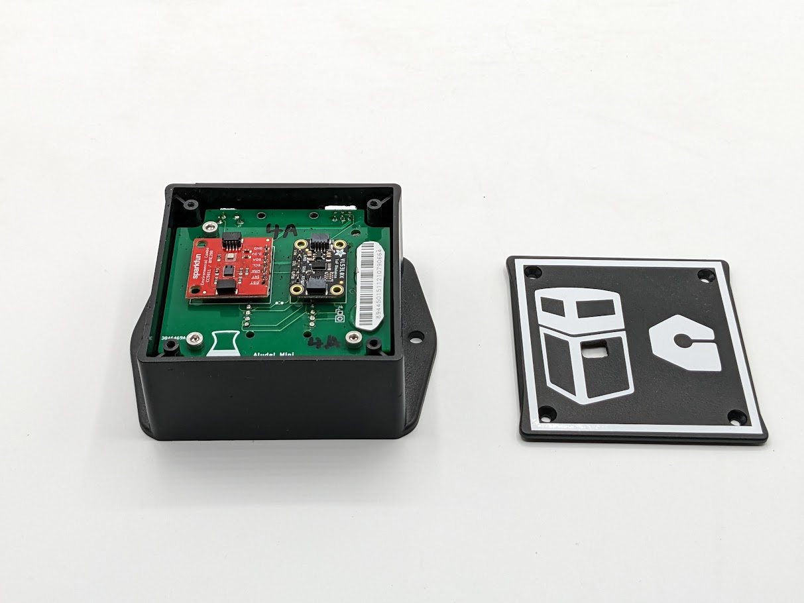

# Golioth Trashcan Monitor Reference Design

This reference design outlines a solution for remotely monitoring trash
receptacles, specifically tailored for municipalities looking to
optimize waste management. The system is designed to track and report
the fill levels and conditions of various trash bins at regular,
programmable intervals. This data can help municipalities make informed
decisions about waste collection, reducing unnecessary pickups and
improving efficiency.

A key feature of this design is its emphasis on long battery life, as
the monitoring device is intended to be powered by batteries. To
maximize operational efficiency, the device is engineered to minimize
power consumption, ensuring that the batteries can last as long as
possible before needing replacement or recharge. This makes it a
cost-effective and low-maintenance solution for cities aiming to
streamline waste collection while conserving resources. Additionally,
the design supports adaptability, allowing customization of reporting
intervals to suit the specific needs and constraints of the
municipality.

## Supported Hardware

This firmware can be built for a variety of supported hardware
platforms.

> In Zephyr, each of these different hardware variants is given a unique
> "board" identifier, which is used by the build system to generate
> firmware for that variant.
>
> When building firmware using the instructions below, make sure to use
> the correct Zephyr board identifier that corresponds to your
> follow-along hardware platform.

| Hardware                                     | Zephyr Board           | Follow-Along Guide                                                                                                   |
| -------------------------------------------- | ---------------------- | -------------------------------------------------------------------------------------------------------------------- |
|  | `nrf9160dk/nrf9160/ns` | [nRF9160 DK Follow-Along Guide](https://projects.golioth.io/reference-designs/iot-trashcan-monitor/guide-nrf9160-dk) |

**Follow-Along Hardware**

| Hardware                                  | Zephyr Board               | Project Page                                                                                         |
| ----------------------------------------- | -------------------------- | ---------------------------------------------------------------------------------------------------- |
|  | `aludel_elixir/nrf9160/ns` | [Trashcan Monitor Project Page](https://projects.golioth.io/reference-designs/iot-trashcan-monitor/) |

**Custom Golioth Hardware**

## Local set up

> Do not clone this repo using git. Zephyr's `west` meta tool should be
> used to set up your local workspace.

### Install the Python virtual environment (recommended)

``` shell
cd ~
mkdir golioth-reference-design-trashcan
python -m venv golioth-reference-design-trashcan/.venv
source golioth-reference-design-trashcan/.venv/bin/activate
pip install wheel west
```

### Use `west` to initialize and install

``` shell
cd ~/golioth-reference-design-trashcan
west init -m git@github.com:golioth/reference-design-trashcan.git .
west update
west zephyr-export
pip install -r deps/zephyr/scripts/requirements.txt
```

## Building the application

Build the Zephyr sample application for the Aludel Elixir from the top
level of your project. After a successful build you will see a new
`build` directory. Note that any changes (and git commits) to the
project itself will be inside the `app` folder. The `build` and `deps`
directories being one level higher prevents the repo from cataloging all
of the changes to the dependencies and the build (so no `.gitignore` is
needed).

Prior to building, update `VERSION` file to reflect the firmware version
number you want to assign to this build. Then run the following commands
to build and program the firmware onto the device.

> You must perform a pristine build (use `-p` or remove the `build`
> directory) after changing the firmware version number in the `VERSION`
> file for the change to take effect.

``` text
$ (.venv) west build -p -b nrf9160dk/nrf9160/ns --sysbuild app
$ (.venv) west flash
```

Configure PSK-ID and PSK using the device shell based on your Golioth
credentials and reboot:

``` text
uart:~$ settings set golioth/psk-id <my-psk-id@my-project>
uart:~$ settings set golioth/psk <my-psk>
uart:~$ kernel reboot cold
```

## Add Pipeline to Golioth

Golioth uses [Pipelines](https://docs.golioth.io/data-routing) to route
stream data. This gives you flexibility to change your data routing
without requiring updated device firmware.

Whenever sending stream data, you must enable a pipeline in your Golioth
project to configure how that data is handled. Add the contents of
`pipelines/cbor-to-lightdb.yml` as a new pipeline as follows (note that
this is the default pipeline for new projects and may already be
present):

> 1.  Navigate to your project on the Golioth web console.
> 2.  Select `Pipelines` from the left sidebar and click the `Create`
>     button.
> 3.  Give your new pipeline a name and paste the pipeline configuration
>     into the editor.
> 4.  Click the toggle in the bottom right to enable the pipeline and
>     then click `Create`.

All data streamed to Golioth in CBOR format will now be routed to
LightDB Stream and may be viewed using the web console. You may change
this behavior at any time without updating firmware simply by editing
this pipeline entry.

## Golioth Features

This app currently implements Over-the-Air (OTA) firmware updates,
Settings Service, Logging, RPC, and both LightDB State and LightDB
Stream data.

### Settings Service

The following settings should be set in the Device Settings menu of the
[Golioth Console](https://console.golioth.io).

  - `LOOP_DELAY_S`
    Adjusts the delay between sensor readings. Set to an integer value
    (seconds).

    Default value is `60` seconds.

  - `TRASH_CAN_HEIGHT_MM`
    Set the trashcan height. Set to an integer value (millimeters).

    Default value is `500` millimeters.

### LightDB Stream Service

Sensor data is periodically sent to the following endpoints of the
LightDB Stream service:

  - `weather/gas/co2`: Carbon Dioxide(ppm)
  - `weather/gas/voc`: Volatile Organic Compounds (ppb)
  - `weather/humidity`: Humidity (%RH)
  - `weather/pressure`: Pressure (kPa)
  - `weather/temp`: Temperature (°C)
  - `VL53/distance`: Distance to waste (mm)
  - `VL53/fill level`: Trashcan fill level (%)
  - `accel/x`: Acceleration X-axis (m/s²)
  - `accel/y`: Acceleration Y-axis (m/s²)
  - `accel/z`: Acceleration Z-axis (m/s²)

Battery voltage and level readings are periodically sent to the
following `battery/*` endpoints:

  - `battery/batt_v`: Battery Voltage (V)
  - `battery/batt_lvl`: Battery Level (%)

### Remote Procedure Call (RPC) Service

The following RPCs can be initiated in the Remote Procedure Call menu of
the [Golioth Console](https://console.golioth.io).

  - `get_network_info`
    Query and return network information.

  - `reboot`
    Reboot the system.

  - `set_log_level`
    Set the log level.

    The method takes a single parameter which can be one of the
    following integer values:

      - `0`: `LOG_LEVEL_NONE`
      - `1`: `LOG_LEVEL_ERR`
      - `2`: `LOG_LEVEL_WRN`
      - `3`: `LOG_LEVEL_INF`
      - `4`: `LOG_LEVEL_DBG`

## Hardware Variations

This reference design may be built for a variety of different boards.

Prior to building, update `VERSION` file to reflect the firmware version
number you want to assign to this build. Then run the following commands
to build and program the firmware onto the device.

### Golioth Aludel Elixir

This reference design may be built for the Golioth Aludel Elixir board.
By default this will build for the latest hardware revision of this
board.

``` text
$ (.venv) west build -p -b aludel_elixir/nrf9160/ns --sysbuild app
$ (.venv) west flash
```

To build for a specific board revision (e.g. Rev A) add the revision
suffix `@<rev>`.

``` text
$ (.venv) west build -p -b aludel_elixir@A/nrf9160/ns --sysbuild app
$ (.venv) west flash
```

## OTA Firmware Update

This application includes the ability to perform Over-the-Air (OTA)
firmware updates:

1.  Update the version number in the
    <span class="title-ref">VERSION</span> file and perform a pristine
    (important) build to incorporate the version change.
2.  Upload the
    <span class="title-ref">build/app/zephyr/zephyr.signed.bin</span>
    file as an artifact for your Golioth project using
    <span class="title-ref">main</span> as the package name.
3.  Create and roll out a release based on this artifact.

Visit [the Golioth Docs OTA Firmware Upgrade
page](https://docs.golioth.io/firmware/golioth-firmware-sdk/firmware-upgrade/firmware-upgrade)
for more info.

## External Libraries

The following code libraries are installed by default. If you are not
using the custom hardware to which they apply, you can safely remove
these repositories from `west.yml` and remove the includes/function
calls from the C code.

  - [golioth-zephyr-boards](https://github.com/golioth/golioth-zephyr-boards)
    includes the board definitions for the Golioth Aludel-Mini
  - [zephyr-network-info](https://github.com/golioth/zephyr-network-info)
    is a helper library for querying, formatting, and returning network
    connection information via Zephyr log or Golioth RPC
